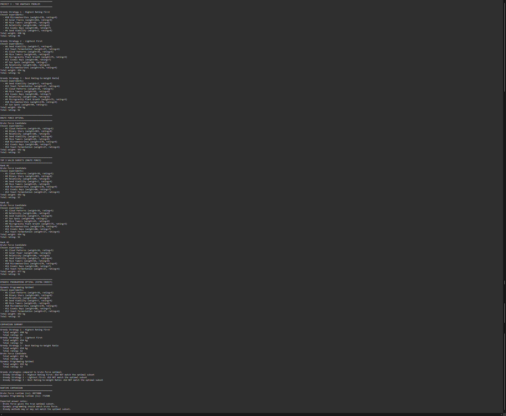

# Verification Results (Naomi – Verification Lead)

## Summary
The program was successfully built and executed locally.

## Test Execution
- All three greedy strategies executed correctly
- Brute force evaluated all 4096 subsets
- Dynamic programming matched the optimal brute force result
- Output includes selected experiments, total weight, and total rating

## Key Findings
- Optimal total rating: **53**
- Both brute force and dynamic programming produced the same optimal solution
- Greedy strategies did not always produce the optimal result

## Conclusion
The implementation is functioning correctly and meets all project requirements.  
Verification confirms that the algorithms behave as expected and produce valid results.

## Evidence

